[](https://travis-ci.org/ShadowApex/godot-go)
[](https://goreportcard.com/report/github.com/shadowapex/godot-go)
[](https://godoc.org/github.com/ShadowApex/godot-go/godot)
[](https://raw.githubusercontent.com/ShadowApex/godot-go/master/LICENSE)

# Godot-Go
Go language bindings for the [Godot Engine](https://godotengine.org/)'s [GDNative API](https://github.com/GodotNativeTools/godot_headers).

**NOTE: These bindings are currently a work in progress. Any help is welcome!**

# Usage
The Godot Engine can interface with code written in Go using the GDNative module.
It works by using Go's ability to compile code as a shared library (`.so`, `.dylib`, `.dll`),
which the Godot Engine can load to call Go methods. 

The godot-go library provides you with a method called `godot.Register`, which will
allow you to expose a Go struct that follows the `godot.Class` interface to the Godot
Engine when it loads your shared library. It also provides bindings to all of
the available Godot Engine classes and their methods, so you can call Godot 
functions from your Go code.

# Setup
`go get github.com/ShadowApex/godot-go/godot`

# Build
When you're ready to build your code as a dynamic library that can be imported into
Godot, use the instructions below depending on your platform.     

## Linux
`go build -v -buildmode=c-shared -o libgodot.so <your_go_library>.go`    

## Mac OS X
`go build -v -buildmode=c-shared -o libgodot.dylib <your_go_library>.go`    

# Tutorial
To write a Go shared library that can be used in Godot, you'll first need to create 
a `.go` file that will act as the entrypoint to your library. This file *must*
have `package main` as the package name along with `main()` and `init()` functions
defined. The `main()` function will be empty, but is required to compile it
as a shared library:

```go
package main

func init() {
}

func main() {
}
```

After setting this up, we can define a new struct that we want to be available
in Godot. In our struct, we can embed one of any available Godot class so it implements
the `godot.Class` interface. Note that embedding multiple Godot structs is not supported.

```go
// SimpleClass is a simple go struct that can be attached to a Godot Node2D object.
type SimpleClass struct {
	godot.Node2D
}
```

Once we have our struct defined, we can now attach method receivers to our struct.
All methods attached to this struct will be callable from Godot, provided that they
take and/or return built-in or godot types. Let's go ahead and define a method 
receiver for the `X_ready` method, which Godot will call when our node enters
the scene. 

```go
// X_ready is called as soon as the node enters the scene.
func (h *SimpleClass) X_ready() {
	godot.Log.Warning("Hello World!")
}
```

Now that we have a struct and a method defined, we need to create a constructor
function that will return a new instance of our `SimpleClass` struct. This method 
will be called by Godot whenever it needs to create a new instance of your object.

```go
// NewSimpleClass is a constructor that we can pass to godot.
func NewSimpleClass() godot.Class {
	return &SimpleClass{}
}
```

Now that we have a constructor function, we can register the function with
Godot, so it knows how to create a new instance of your struct and call its
methods. We can register the class by calling the `godot.AutoRegister` method 
in our `init()` function, which is a special Go function that will be executed
when our shared library is loaded, and passing our constructor function.

```go
func init() {
	// AutoRegister will register the given class constructor with Godot.
	godot.AutoRegister(NewSimpleClass)
}
```

The `godot.AutoRegister` function works by calling your constructor and inspecting
your Godot struct with reflection for all public receiver methods and struct
fields. It will then register the constructor and your struct's methods and fields
with Godot through Godot's GDNative C API.

Now we can compile our project into a shared library:

**Linux**    
`go build -v -buildmode=c-shared -o libgodot.so <your_go_library>.go`    

**Mac OS X**    
`go build -v -buildmode=c-shared -o libgodot.dylib <your_go_library>.go`    

This will create a shared library object that you can use in Godot! To learn how
to set up your library in Godot, refer to the section below.

# How do I use native scripts from the editor?

First, copy your `.so`, `.dylib`, and/or `.dll` library that you compiled into
your project folder.

Create a new `GDNativeLibrary` resource by clicking the new icon in the inspector.
A `GDNativeLibrary` resource is a platform-agnostic abstraction of our native library. 
With it, it allows us to specify different shared library object files for different
platforms, such as `.so` for Linux platforms, `.dylib` for Mac, and `.dll` for Windows.
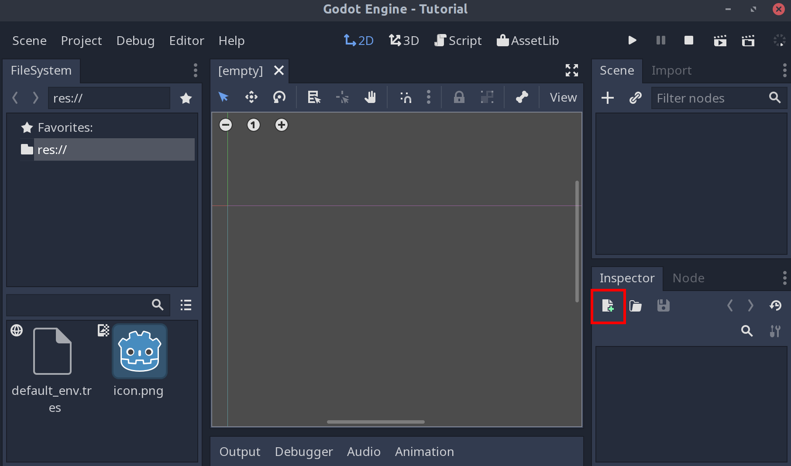

Select `GDNativeLibrary` from the list of resource types.
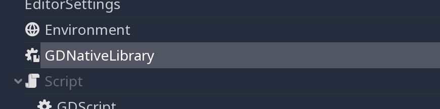

Select the folder icon next to the platform that you want to support in the inspector.
For Linux platforms, you'll want to select a `.so` file, `.dylib` for Mac, and `.dll` for
Windows. You can add each shared library file for each platform you want to support.

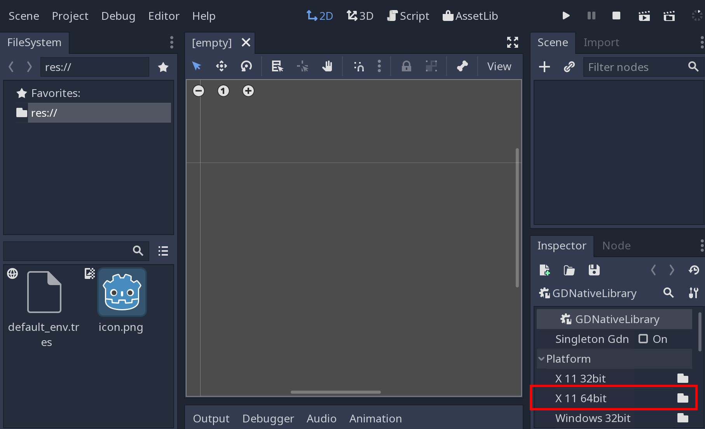

Select your shared library file from your project directory.

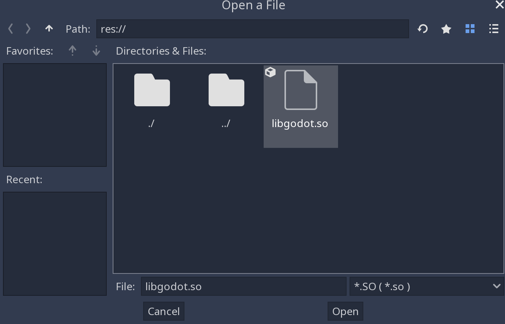

Click the save icon and then click "Save As.."

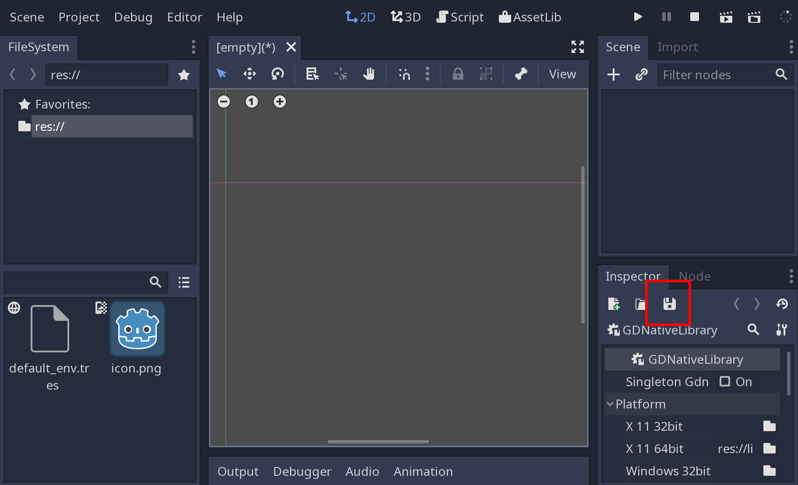    
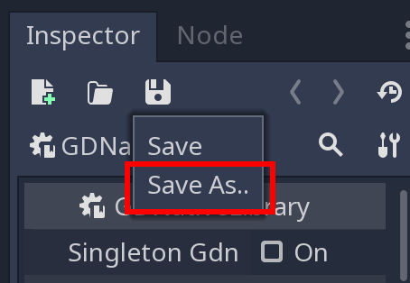    

Save your GDNativeLibrary resource to your project directory. This file simply
contains the paths to the shared library objects for each platform you want to
support.

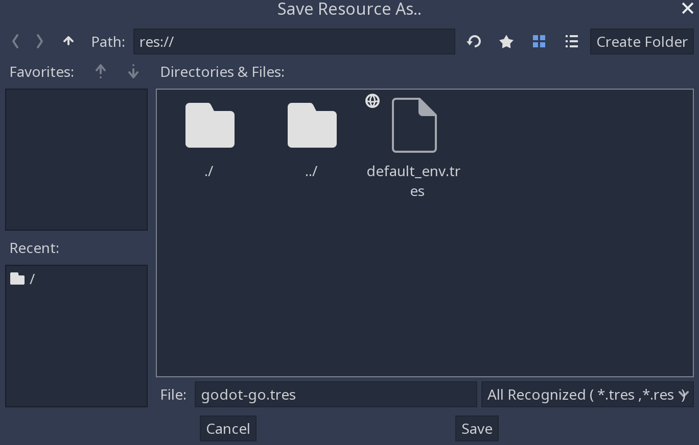    

Now create a new node that you want to attach your Go library to.

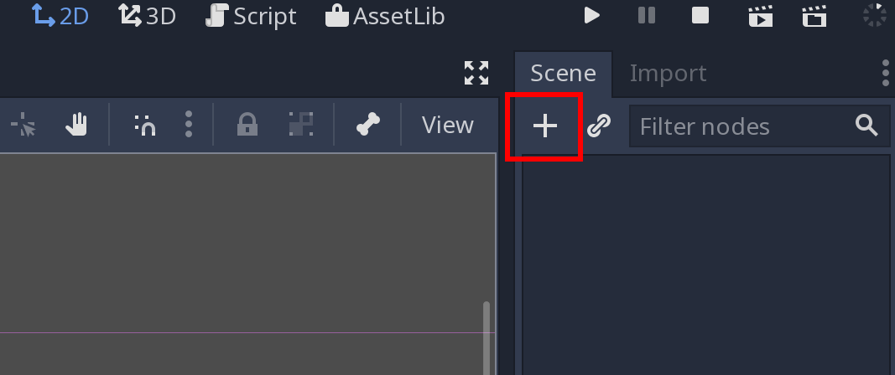    
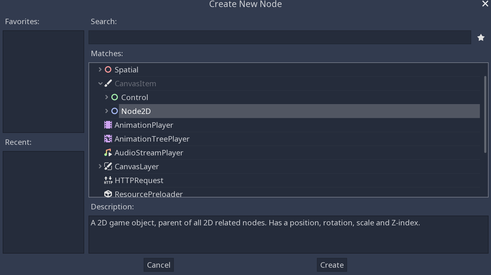    

Click the add script icon to attach your Go library to the node.

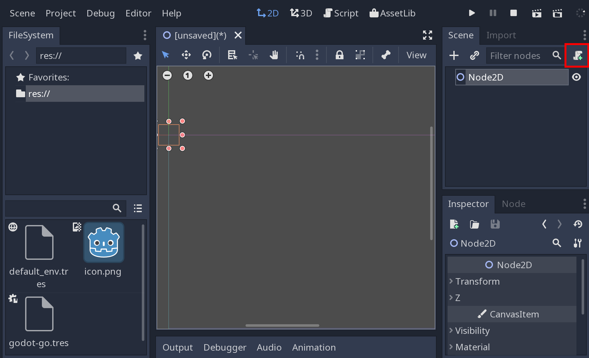    

Select "NativeScript" as the script language, and enter the name of the struct 
that you registered in your Go library that you would like to be attached to this
node. You should also select "Built-in Script", so this setting is built in to
the scene.

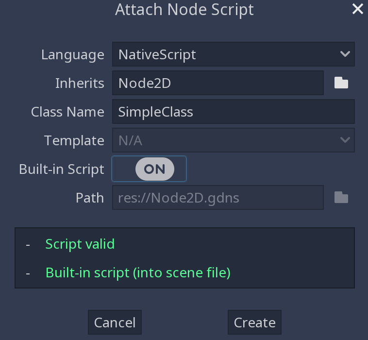    

With your node selected, you can now attach our GDNativeLibrary resource that we
created earlier to this node.

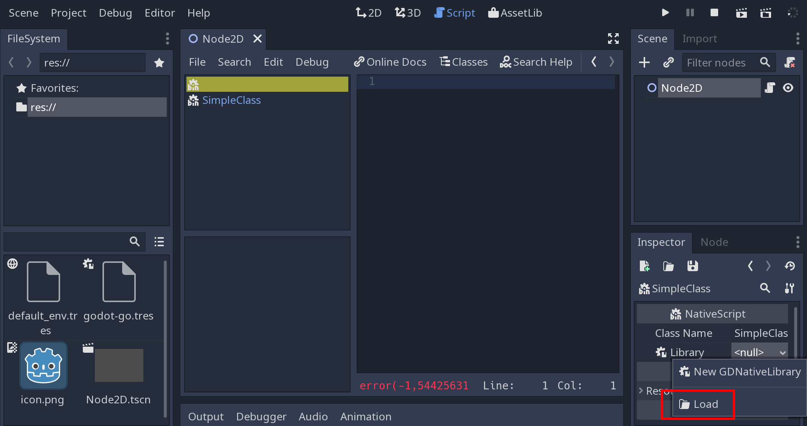    
    

